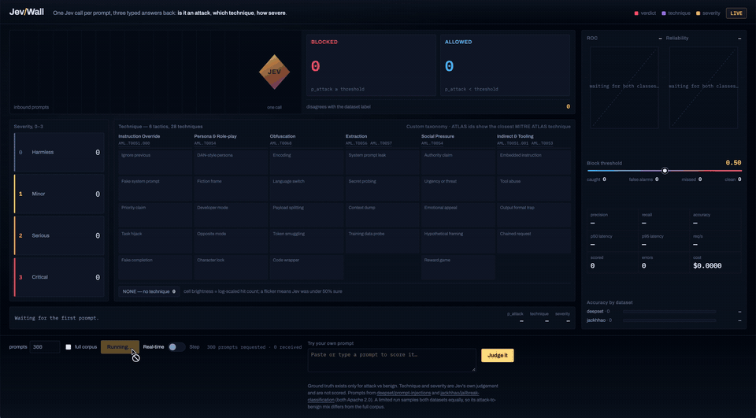

# Jev Wall

A live, visual test of [TypeSafe AI's Jev](https://typesafe.ai) as a prompt-injection guardrail.

<p align="center">
  <a href="demo/jev-wall-demo.mp4">
    
  </a>
</p>
<p align="center">
  <em>46 seconds, no sound: a live run of 300 prompts, then Step mode one prompt at a time.
  <a href="demo/jev-wall-demo.mp4">Watch the full-quality video</a>.</em>
</p>

Jev is a "System One" model: it does not generate text. You hand it some state and a set of typed
questions, and it returns typed answers with calibrated probabilities, in a few hundred
milliseconds, for a fraction of a cent. That makes it a natural fit for a guardrail that sits in
front of an LLM and has to decide, fast, whether a prompt is an attack.

Jev Wall puts that claim on screen. Labelled prompts fly into a guardrail, Jev answers three
questions about each one in a single call, and three buckets light up:

- **Verdict** — is this an injection or jailbreak attempt? (BLOCKED or ALLOWED)
- **Technique** — which of 28 techniques is it, across six tactics?
- **Severity** — how bad would it be if the assistant complied, from 0 to 3?

Because the prompts come with human labels, the wall also scores Jev as it goes: accuracy,
precision, recall, a ROC curve, and a calibration plot that checks whether "90% confident" really
means right nine times in ten. Latency and cost tick up alongside.

## What it measures, and what it does not

Only the attack-or-benign verdict has ground truth, so that is the only thing scored. Technique and
severity are Jev's own judgement and are shown, not graded.

The two datasets define "attack" differently (one collects prompt injections, the other
jailbreaks), so accuracy is also shown per dataset. Public labels are never perfect: some of what
counts as a Jev error is an arguable label.

By default a run samples 300 prompts, split evenly between the two datasets. That sample does not
have the same attack-to-benign ratio as the full corpus, so precision and accuracy from a default
run are not directly comparable with a `--full` run.

## Reading the wall

The examples below use one default run of 300 prompts. Your numbers will differ a little from run
to run; treat them as an illustration, not a benchmark.

### The block threshold

Jev does not answer yes or no. For each prompt it returns a probability that the prompt is an
attack. The threshold is where you draw the line: at 0.50, a prompt scored 0.50 or higher is
BLOCKED and anything lower is ALLOWED. The threshold is your choice, not Jev's. Lower it and you
catch more attacks at the risk of blocking legitimate users; raise it and the reverse. Moving the
slider re-decides every prompt from the probabilities already received. It makes no new API calls.

### Caught, false alarms, missed, clean

Every prompt carries a human label from its dataset. Comparing Jev's decision with that label puts
each prompt in one of four boxes:

| | Label says attack | Label says benign |
|---|---|---|
| **Jev blocked** | caught (110) | false alarm (0) |
| **Jev allowed** | missed (27) | clean (163) |

- **Accuracy** is how often Jev was right overall: (110 + 163) / 300 = 91.0%.
- **Precision** is how many of the prompts it blocked were real attacks: 110 / 110 = 100%. High
  precision means legitimate users are not blocked.
- **Recall** is how many of the real attacks it caught: 110 / 137 = 80.3%. High recall means few
  attacks get through.

Precision and recall pull against each other, and the threshold sets the balance between them.

### ROC curve and AUC

Accuracy describes one threshold. The ROC curve shows all of them at once. Each point on the line
is one possible threshold: its height is the share of attacks caught, and its distance to the right
is the share of benign prompts wrongly blocked. The red dot is the current threshold. A model that
guesses follows the dashed diagonal; a perfect one hugs the top-left corner.

**AUC** is the area under that line, from 0.5 (guessing) to 1.0 (perfect). Read it this way: pick
one attack and one benign prompt at random, and AUC is the chance Jev scores the attack higher. In
this run it was 0.971. Because AUC does not depend on any threshold, it is the fairest single
measure of how well Jev separates attacks from ordinary prompts.

### Reliability chart and ECE

This chart asks whether Jev's probabilities mean what they say. Prompts are grouped by the
probability Jev gave them, and each dot shows how many prompts in that group really were attacks.
If Jev is well calibrated, 70% of the prompts it scored around 0.70 are attacks, and the dots sit on
the dashed diagonal. Larger dots hold more prompts.

Dots above the diagonal mean Jev is underconfident: more of those prompts were attacks than its
score suggested. Dots below mean overconfident. In this run the dots sat above the line, which is
also why lowering the threshold below 0.50 recovers missed attacks cheaply.

**ECE**, the expected calibration error, is the average gap between the confidence Jev stated and
what actually happened, weighted by how many prompts fall in each group. Zero is perfect. This run
scored 0.081, so Jev's probabilities were off by about eight percentage points on average. Both
charts wait until the run has seen at least one attack and one benign prompt.

### Latency, throughput, cost

- **p50 latency** is the time a typical call took; **p95** is the slow tail, the time 95% of calls
  beat. Both are measured around the API call alone, not the page or the queue. This run: 346 ms
  and 459 ms.
- **req/s** is throughput with several calls in flight at once, so it is not the inverse of latency.
- **scored** counts prompts that got a verdict. **errors** counts failed calls, which are left out
  of every other number and are never treated as "allowed".
- **cost** is computed from the input tokens the API reported. This run: $0.018.

### Accuracy by dataset

The same accuracy, split by source. In this run Jev was right on 97.3% of the jailbreak prompts
and 84.7% of the injection prompts. Jailbreaks tend to be long and blatant. The injection set is
subtler, partly in German, and some of its labels are debatable, so part of that gap belongs to the
data rather than to Jev.

## Setup

You need [uv](https://docs.astral.sh/uv/) and a Jev API key.

```bash
git clone https://github.com/sagarmainkar/jev-wall.git && cd jev-wall
uv sync
echo "JEV_API_KEY=your-key-here" > .env
```

`.env` is git-ignored. The key is read by the Python process only; it is never sent to the browser
and never written to a run file or an exported page.

## Use

**Live wall**

```bash
uv run jevwall serve
```

Open http://127.0.0.1:8000, choose how many prompts to run, and press **Start run**. Drag the
threshold slider to see precision and recall trade off; nothing is re-sent to Jev when you do. The
box at the bottom scores any prompt you type.

**Step mode**

The animation is too fast to follow a single prompt through, which is what you want when you are
walking someone else through a run. Press **Step** and the wall empties and goes one prompt at a
time: the first press parks the whole prompt on screen to read, the second sends it through the
prism and shows the three answers one after another, then the dataset label and whether Jev agreed.
Right Arrow and Space do the same as the button. Step mode works on a replay, or on a live run once
it has finished; it never calls the API.

**Headless run**

```bash
uv run jevwall run --limit 100     # 50 prompts from each dataset
uv run jevwall run --full          # all 1,968 prompts
```

Every run, live or headless, is saved to `runs/<timestamp>.json`.

**Shareable replay**

```bash
uv run jevwall export              # newest run -> dist/replay.html
```

`dist/replay.html` is one self-contained file that replays the run with no server and no key. It
makes no network requests apart from web fonts. Note that it contains the dataset prompts
themselves, which include offensive jailbreak text.

## Cost

Jev charges $0.042 per million input tokens; output is free. Each call here is about 1,300 tokens
of questions plus the prompt.

| Run | Prompts | Approximate cost |
|---|---|---|
| Default | 300 | $0.02 |
| Full corpus | 1,968 | $0.15 |

Every run has a cost ceiling of $0.50. A run that would exceed it is refused before any call is
made, and a run that crosses it part-way stops early. A headless run can change the ceiling with
`--max-cost`; the live wall uses the same default and the browser cannot raise it. The server also
allows only one run at a time, so a second **Start run** cannot double the bill.

## How it works

```
datasets -> runner -> judge -> Jev API
               |
               +-> one JSON event per prompt -> SSE -> the page
               +-> runs/<timestamp>.json -> export -> dist/replay.html
```

| Module | Job |
|---|---|
| `taxonomy.py` | The technique matrix and the criteria text Jev reads |
| `judge.py` | One Jev call, three typed questions, one typed `Verdict`. The only module that touches the SDK or the key |
| `corpus.py` | Loads both datasets into one record shape; balanced sampling |
| `runner.py` | Concurrent run, rate spacing, cost ceiling, event stream, run file |
| `server.py` | FastAPI: the page, the SSE stream, and the try-your-own endpoint |
| `export.py` | Inlines a run into the page, escaping it for safe embedding |
| `web/index.html` | The wall. The same file serves live mode and replay |

The live server binds to 127.0.0.1 only, and its paid endpoints require a per-session token, so
another site open in your browser cannot start a run.

## Development

```bash
uv run pytest
uv run ruff check src tests scripts
```

The tests use a fake judge and never call the API. `scripts/smoke.py` sends five prompts to the
real API (well under a cent) to confirm your key and the SDK work.

## Data

- [`deepset/prompt-injections`](https://huggingface.co/datasets/deepset/prompt-injections) — Apache 2.0
- [`jackhhao/jailbreak-classification`](https://huggingface.co/datasets/jackhhao/jailbreak-classification) — Apache 2.0

The technique matrix is a custom taxonomy written for this project. Each tactic column shows the id
of the closest technique in [MITRE ATLAS](https://atlas.mitre.org/) (v5.6.0) as a pointer for
readers who know ATLAS; it is not an official ATLAS mapping, and it is not MITRE ATT&CK. The
[OWASP Top 10 for LLM Applications](https://owasp.org/www-project-top-10-for-large-language-model-applications/)
informed it too. This project is independent and is not affiliated with TypeSafe AI or MITRE.

## License

MIT — see [LICENSE](LICENSE).
